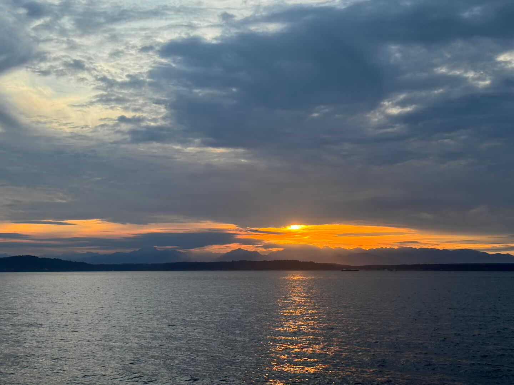
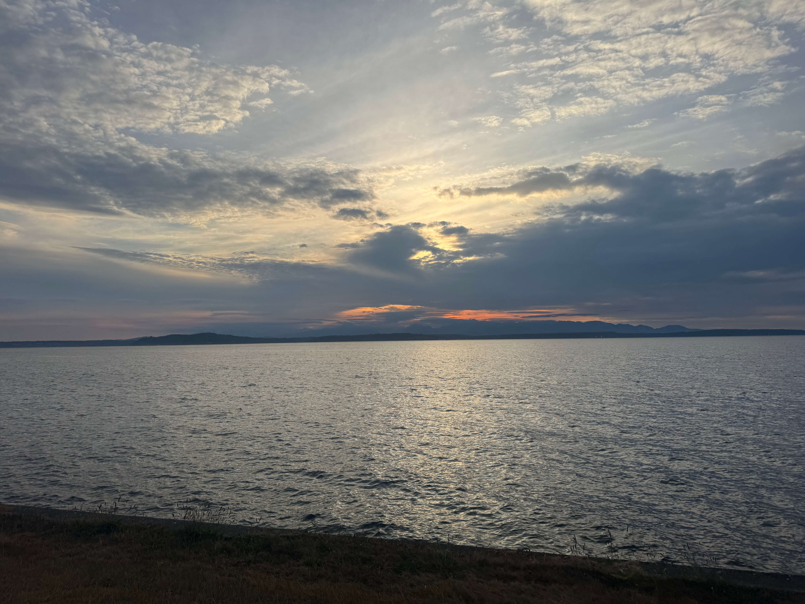
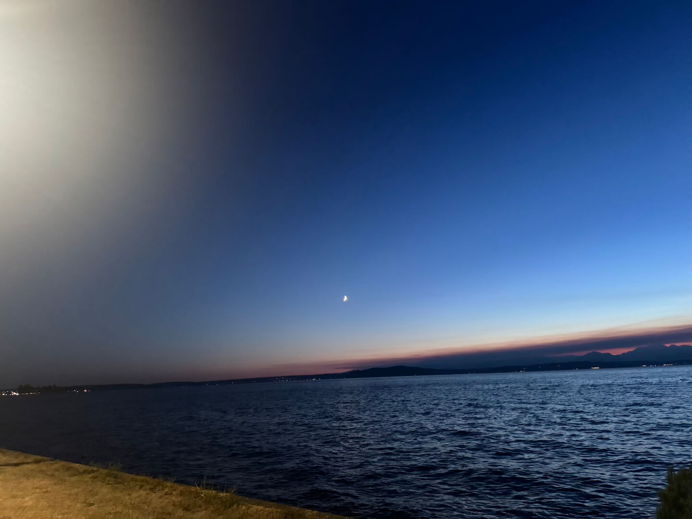
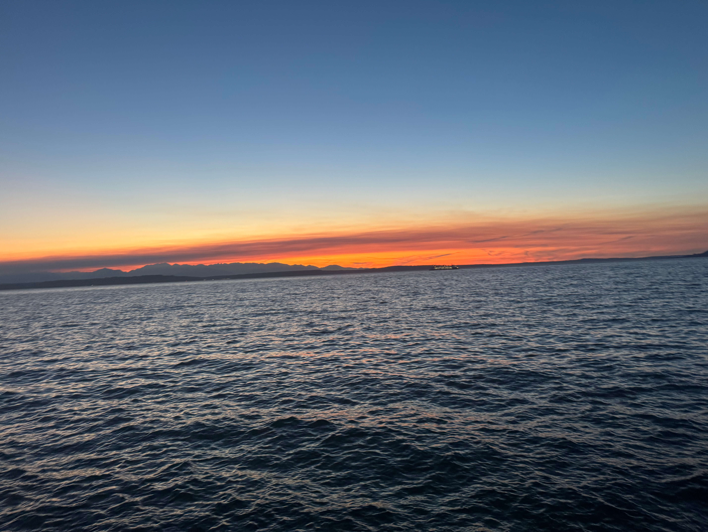
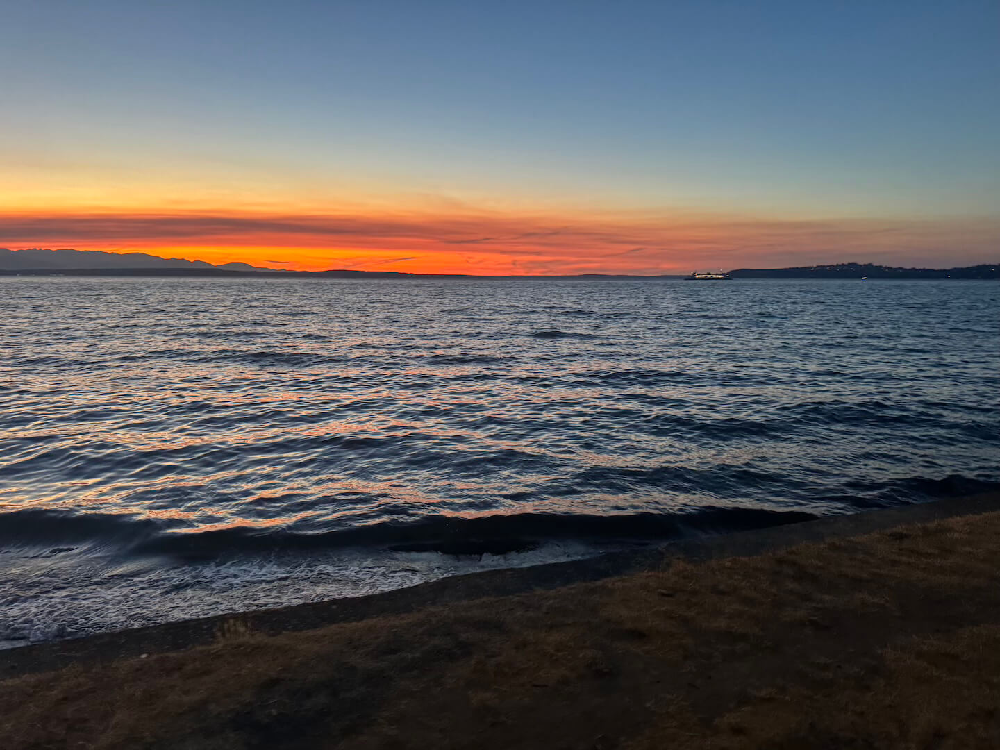
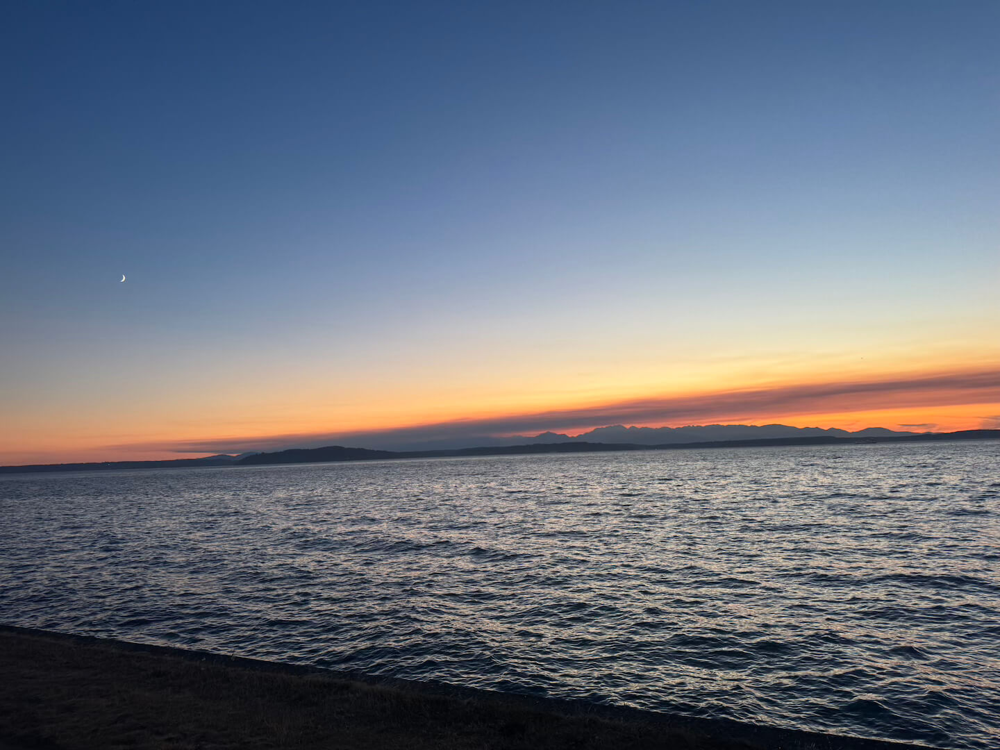

## 👋 I'm Abdulahi

<!--
**Abdulahi-1/Abdulahi-1** is a ✨ _special_ ✨ repository because its `README.md` (this file) appears on your GitHub profile.
-->
🎓 CS + INFO @ University of Washington

💻 Aspiring Software Engineer

🚀 I enjoy building apps that blend **design + technology**

### 🔭 I’m currently working on:
  - **BenefitsBridge** – iOS app that connects people to federal government support programs 
  - **Tumblr Feed** – mobile app that fetches and displays Tumblr blog posts
  - **Trivia App** – quiz app powered by the Open Trivia Database API
  - **Portfolio Website** - website that showcases my past completed projects
    
---
  
### 🌱 I’m currently learning:
  - Software Design and Implementations (CSE 331)  
  - Beginner iOS development (APIs, UIKit/SwiftUI, Prototyping)
  - Interaction Programming (CSE 340)
  - Foundational Data Science (INFO 201)

---

### 👯 I’m looking to collaborate on:
  - Open-source Front-end Development
  - Apps that create social good and accessibility impact

---

### 💬 Ask me about:  
  - My experiences with iOS development (UIKit, Storyboard, APIs) 
  - Python, Swift basics
  - My process for building and designing clean & user-centered apps
  - Photography and beautiful beaches!

---

### 📫 How to reach me:  
  - LinkedIn: https://www.linkedin.com/in/abdulahizabdi
  - Email: aza3@cs.washington.edu
  - Portfolio: https://students.washington.edu/aza3

---

### ⚡ Fun fact:  
  I love going outdoors with my family and taking pictures of the beautiful sunsets and oceans across the city of Seattle. I know, I'm a ✨ photographer ✨ in the making. Check out my photo's down below!

### 🖼️ Photo Gallery:

  
  
  
  

  
  
  
  

