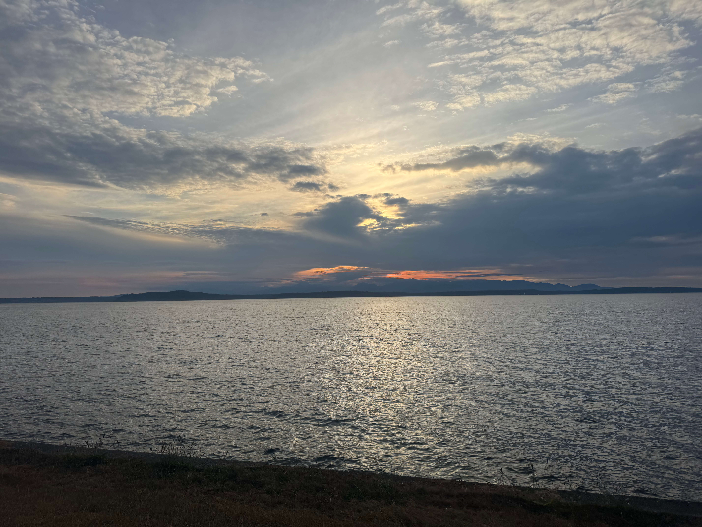
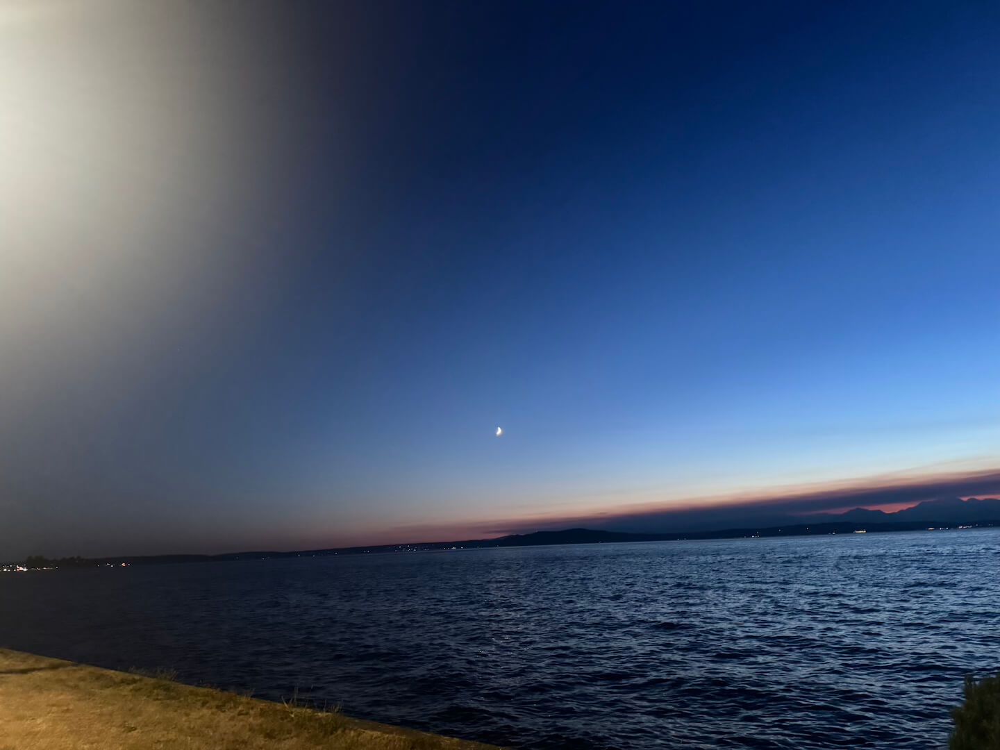
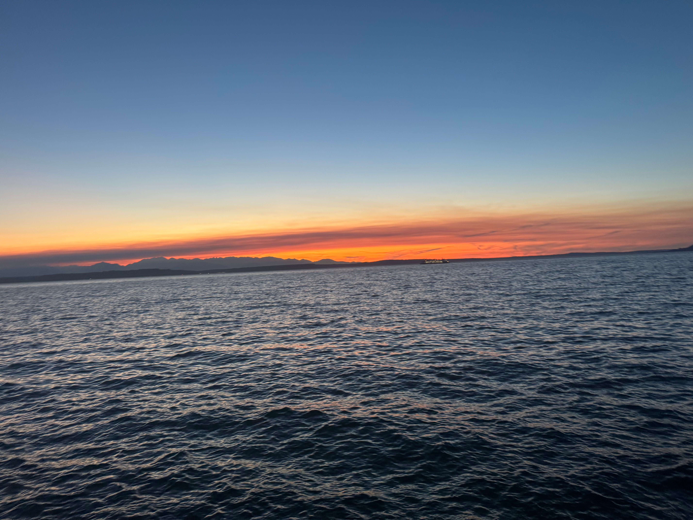
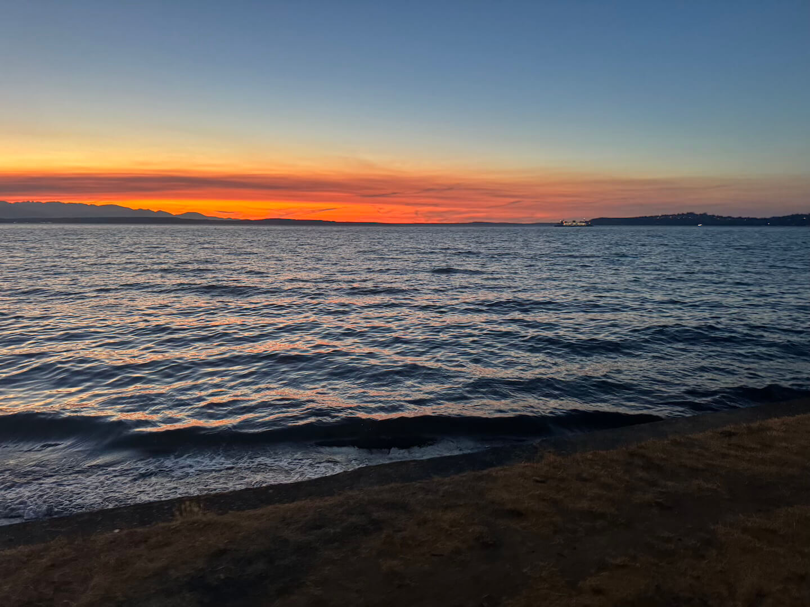
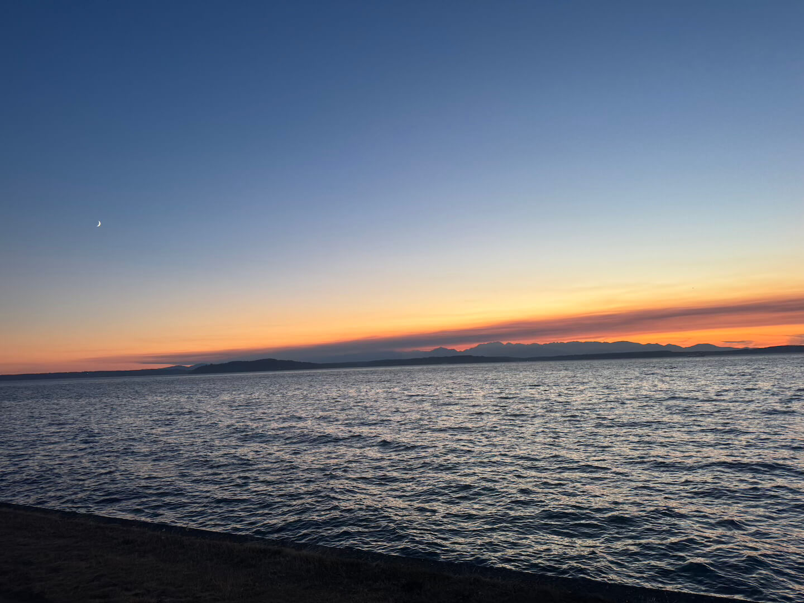

## 👋 I'm Abdulahi

<!--
**Abdulahi-1/Abdulahi-1** is a ✨ _special_ ✨ repository because its `README.md` (this file) appears on your GitHub profile.
-->
🎓 CS + INFO @ University of Washington

💻 Aspiring Software Engineer interested in AI, full-stack development, and intelligent systems

🚀 Experienced through Microsoft, public-sector technology internships, and projects spanning AI-powered applications, developer tools, and user-focused software

---

### 🔭 Featured Projects:

* **BenefitsBridge** – platform connecting users with government assistance programs
* **PawPal++** – AI-powered pet care scheduler using LLM function calling and intelligent task planning
* **MyMILL** – makerspace queue management platform with real-time reservations and AI assistance
* **HuskyAI** – AI-powered chatbot prototype that improves UW students' access to hardware

---

### 🛠️ Technologies:

* Python, Java, JavaScript, Swift, HTML/CSS
* Flutter, Streamlit, React
* Git/GitHub
* APIs, LLMs, AI Agents

---

### 👯 I’m looking to collaborate on:

* Open-source software
* AI-powered applications
* Full-stack development projects
* Technology for social impact

---

### 💬 Lets chat About:

* Software engineering internships
* AI and LLM-powered applications
* Full-stack development
* Technical interviews and career growth
* Building products from idea to deployment

---

### 📫 How to reach me:

* LinkedIn: linkedin.com/in/abdulahizabdi
* Email: [aza3@cs.washington.edu](mailto:aza3@cs.washington.edu)
* Portfolio: students.washington.edu/aza3

---

### ⚡ Fun fact:  
  I love going outdoors with my family and taking pictures of the beautiful sunsets and oceans across the city of Seattle. I know, I'm a ✨ photographer ✨ in the making. Check out my photo's down below!

### 🖼️ Photo Gallery:

  
  
  
  

  
  
  
  

